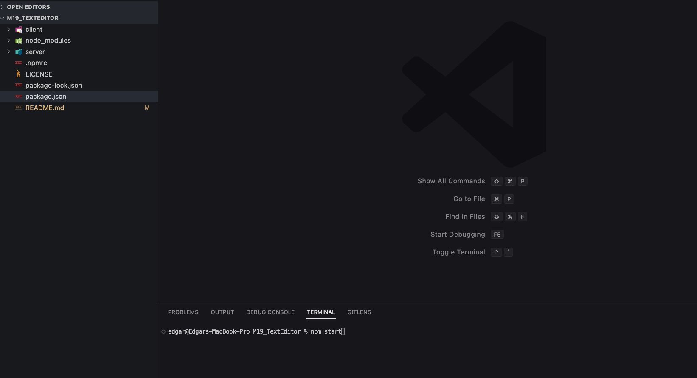
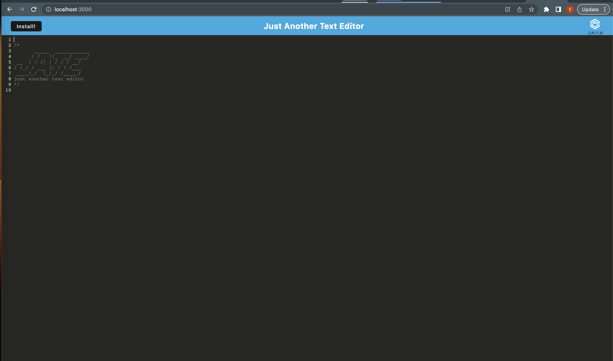
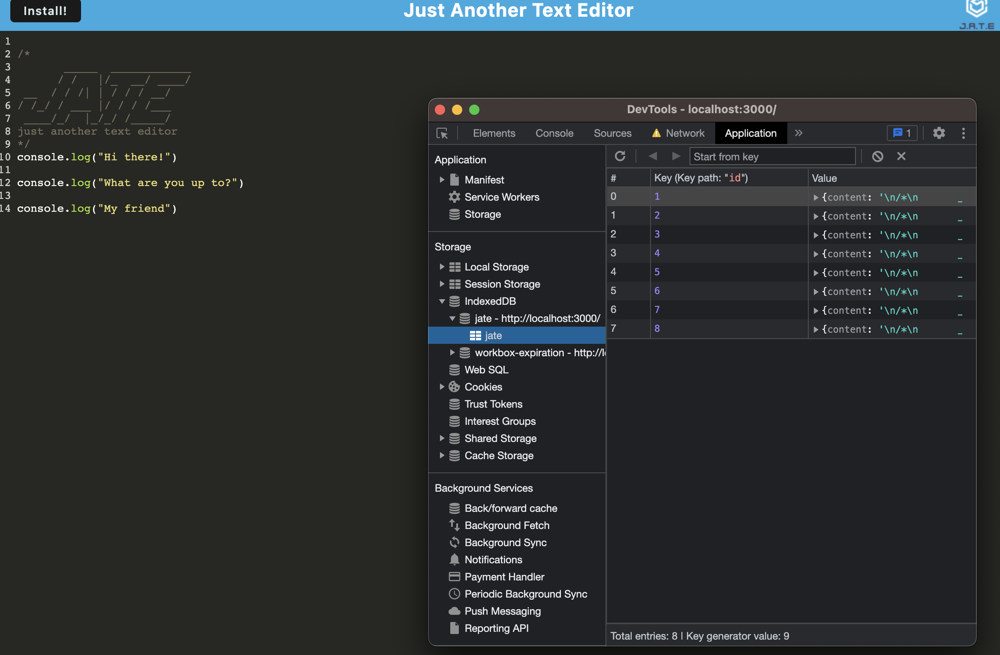
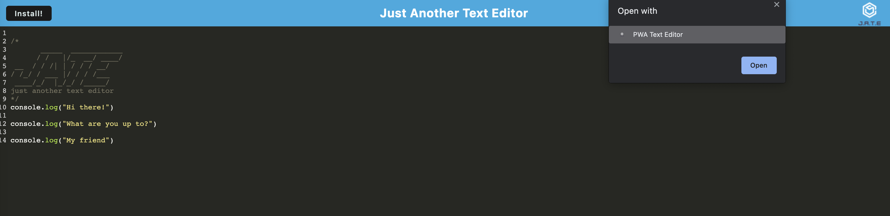
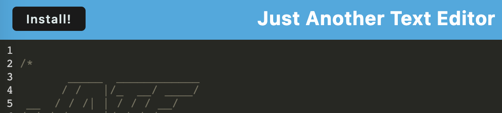
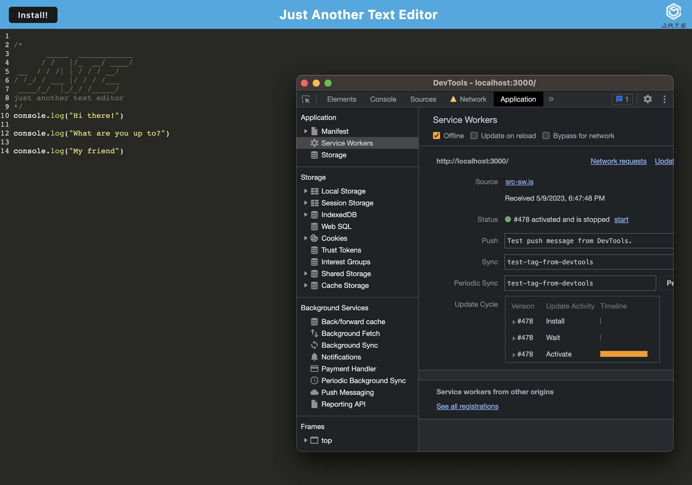
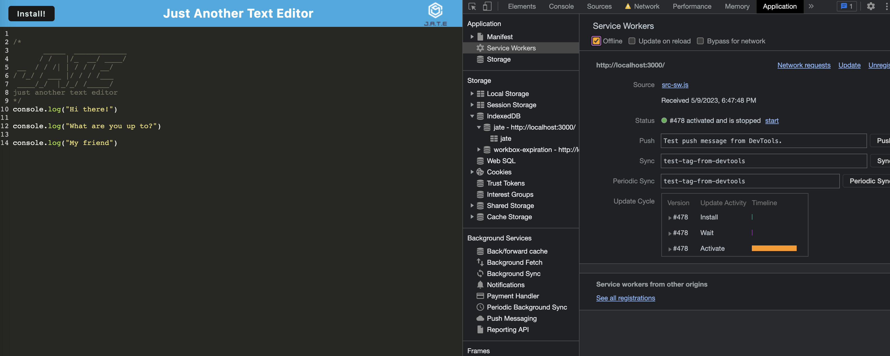

# M19_TextEditor

This project uses the following technologies:

- HTML5
- CSS3
- JavaScript (ES6+)
- Node.js
- Express.js
- Webpack
- Workbox
- IndexedDB
- idb
- Heroku

## Description

This project is a text editor that runs in the browser and functions as a Progressive Web Application (PWA). The text editor app is a single-page application that meets the PWA criteria, functioning offline, and features multiple data persistence techniques to ensure content is saved and available for later use.

## Table of Contents

- [Installation](#installation)
- [Usage](#usage)
- [Credits](#credits)
- [Tests](#tests)

## Installation

1. Clone the repository to your local machine.
2. Navigate to the project root directory.
3. Run `npm install` to install the required dependencies.

Review the code on the GitHub repository by visiting the [GitHub Repository](https://github.com/etapm/M19_TextEditor).

## Usage

1.  To start the application, navigate to the project root directory and run `npm run start`.

    

2.  Open your browser and go to http://localhost:3000 to access the text editor.

    

3.  Use the text editor to create notes or code snippets, which will be saved automatically in IndexedDB.

    

    

4.  To install the text editor as a desktop application, click on the "Install" button.

    

    

5.  To use the text editor offline, click on the "Offline" button.

    

    `Visit the deployed application on Heroku:` [Click Here](https://m19-test-editor.herokuapp.com/)

## Credits

N/A

## License

This project is licensed under the ISC License.

## Badges

N/A

## Features

N/A

## How to Contribute

N/A

## Tests

N?A
